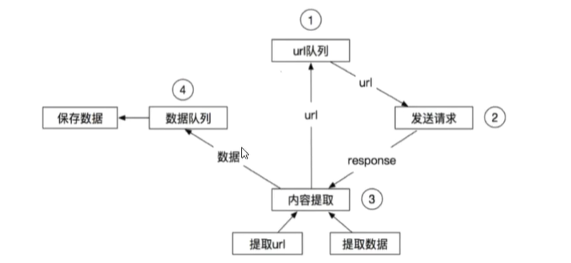
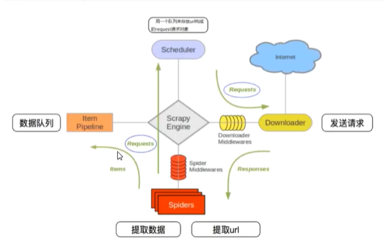
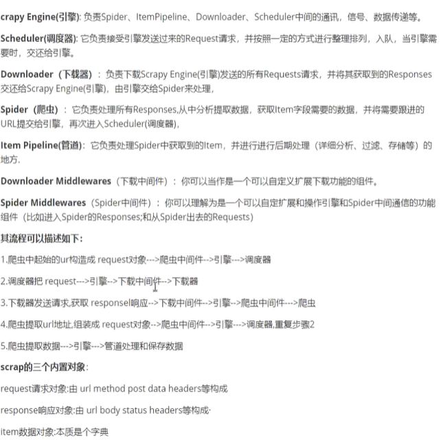
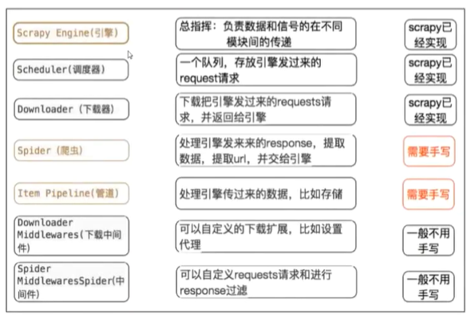
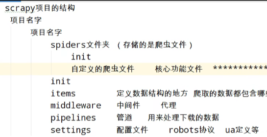

* scrapy 是一个纯 Python 实现爬取网站数据，。提取结构性的数据而编写的应用程序，用途还是十分广泛的
* 框架呐就是实现的是将我们的简单的一个玩意实现抽象成一个规范化的系统
* 这个就是一个 Twisted 网络异步框架，加快了我们的爬取一个数据的速度

scripy 框架的实现原理
> spider 将我们发送原始的请求的 url 地址由引擎传给调度器
> 放到队列中进行去重

`pip install scrapy`
`pip install pypiwin32`

> scrapy 的创建项目的过程
> * scrapy startproject 爬虫的名称
> * 或者使用： scrapy genspider 爬虫名称 爬虫域
> * 爬虫名是我们的用来实是熊安开启的爬虫项目名
> * 爬虫域，就是告诉我们的这个爬虫的时候实现爬取的域的内容是什么
> 
> > 实现创建了后，我们的爬虫就具有了几个比较重要的文件
> 
> > 1.items.py  |  2.middlewares.py  | 3.pipelines.py  | 4.setting.py
> 
> > items.py 就是实现的是我们的建模
> > middlewares.py 就是实现的是我们的中间件的书写
> > pipelines.py 就是我们需要进行保存的数据书写的地方
> > setting.py 就是我们的配置文件
> ` scrapy crawl baidu_scrapy` 实现的是启动项目
> 

[推荐阅读](https://blog.csdn.net/qq_45981086/article/details/128859442)
